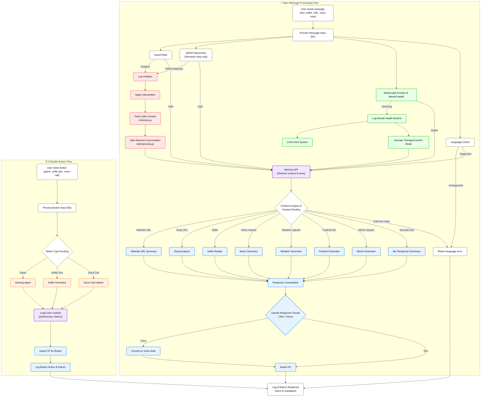
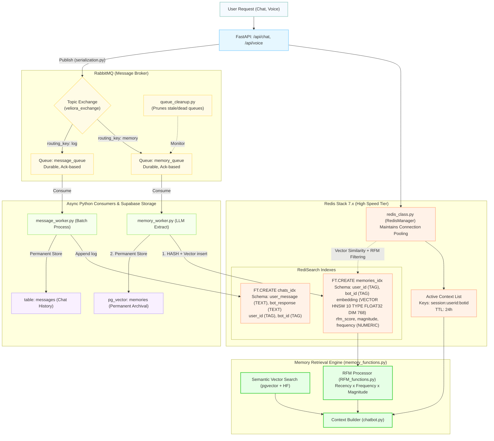
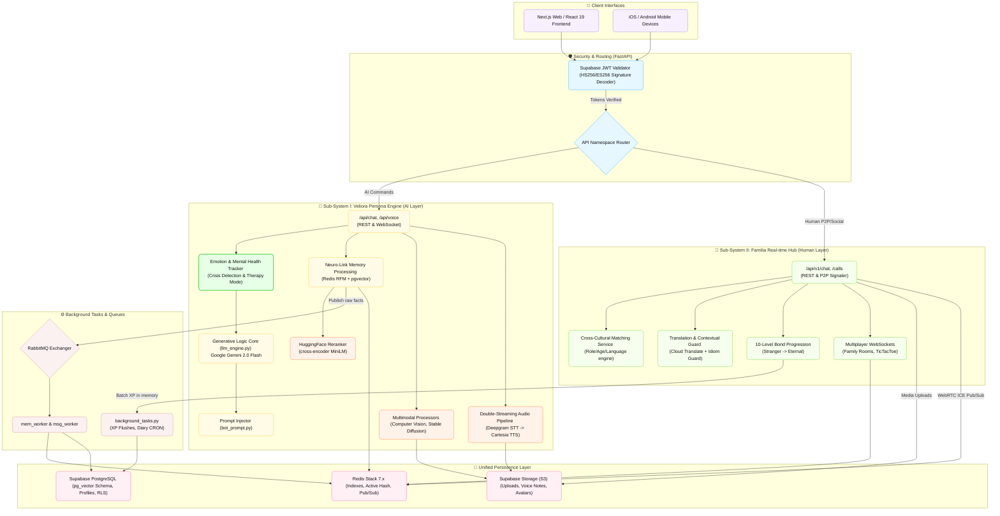

# 🤖 Bot Persona System Architecture

This file contains the high-level diagrams and flowcharts for the **Bot Persona System**, including the **Multimodal Mental Health Trigger System**, the **Redis & RabbitMQ Architecture**, and the **Entire Platform Architecture**.

## 1. Bot Persona System (with Multimodal Emotion & Mental Health)

## 2. Redis & RabbitMQ Architecture (Bot Persona System)

## 3. Entire Architecture (Persona Engine + Real-time Familia)

