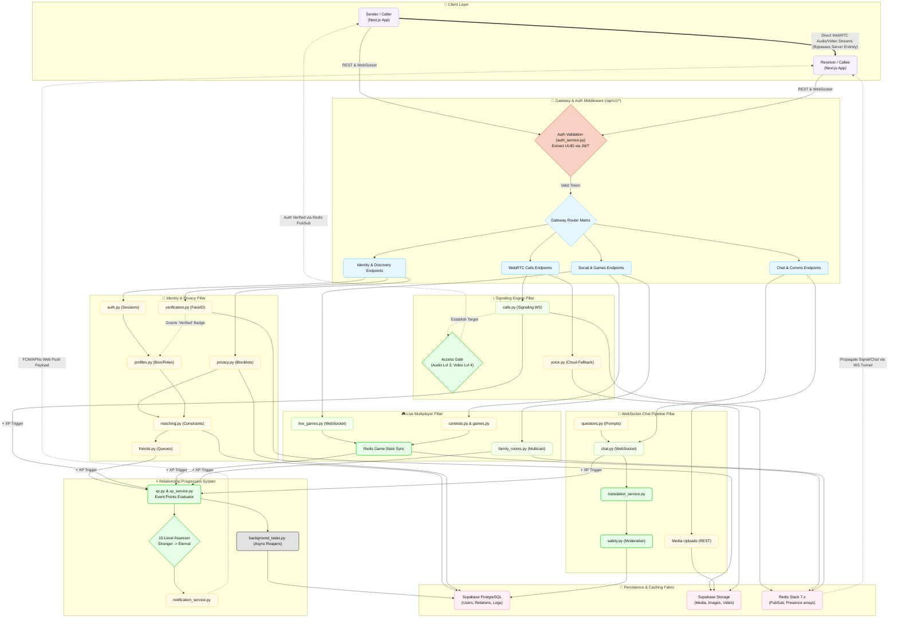

# 🌐 Real-time Communication System Architecture

This file contains the high-level diagrams and flowcharts for the **Real-time Communication Hub (Familia)**.

## 1. Complete System Architecture

```mermaid
flowchart TD
    %% ==========================================
    %% GLOBAL STYLES & THEMES
    %% ==========================================
    classDef client fill:#f9f0ff,stroke:#d0bdf4,stroke-width:2px,color:#111,rx:8,ry:8;
    classDef route fill:#e6f7ff,stroke:#91d5ff,stroke-width:2px,color:#111,rx:8,ry:8;
    classDef service fill:#fffbe6,stroke:#ffe58f,stroke-width:2px,color:#111,rx:8,ry:8;
    classDef ws fill:#f6ffed,stroke:#b7eb8f,stroke-width:2px,color:#111,rx:8,ry:8;
    classDef db fill:#fff0f6,stroke:#ffadd2,stroke-width:2px,color:#111,rx:8,ry:8;
    classDef logic fill:#e6ffe6,stroke:#33cc33,stroke-width:2px,color:#111,rx:8,ry:8;
    classDef auth fill:#f9d0c4,stroke:#e07a5f,stroke-width:2px,color:#111,rx:8,ry:8;
    classDef bg fill:#e2e2e2,stroke:#666666,stroke-width:2px,color:#111,rx:8,ry:8;

    %% ==========================================
    %% 1. CLIENT LAYER
    %% ==========================================
    subgraph Clients ["📱 Client Layer"]
        direction LR
        UserX["Sender / Caller <br/>(Next.js App)"]:::client
        UserY["Receiver / Callee <br/>(Next.js App)"]:::client
    end
    
    UserX == "Direct WebRTC Audio/Video Streams <br/>(Bypasses Server Entirely)" ==> UserY

    %% ==========================================
    %% 2. GATEWAY & ROUTING BUS
    %% ==========================================
    subgraph API_Gateway ["🚪 Gateway & Auth Middleware (/api/v1/*)"]
        direction TB
        JWTAuth{"Auth Validation (auth_service.py)<br/>Extract UUID via JWT"}:::auth
        RouterMatrix{"Gateway Router Matrix"}:::route
        
        %% Categorized router endpoints
        RouteIden["Identity & Discovery Endpoints"]:::route
        RouteComm["Chat & Comms Endpoints"]:::route
        RouteCall["WebRTC Calls Endpoints"]:::route
        RouteSoc["Social & Games Endpoints"]:::route
        
        JWTAuth -- "Valid Token" --> RouterMatrix
        RouterMatrix --> RouteIden & RouteComm & RouteCall & RouteSoc
    end

    UserX & UserY -->|REST & WebSocket| JWTAuth

    %% ==========================================
    %% 3. CORE SERVICES (Isolated Vertical Pillars)
    %% ==========================================
    
    subgraph Discovery_Identity ["👤 Identity & Privacy Pillar"]
        direction TB
        Auth_API["auth.py (Sessions)"]:::service
        Profile_API["profiles.py (Bios/Roles)"]:::service
        Privacy_API["privacy.py (Blocklists)"]:::service
        Verification["verification.py (FaceID)"]:::service
        Match_API["matching.py (Constraints)"]:::service
        Friends_API["friends.py (Queues)"]:::service
        
        Auth_API --> Profile_API
        Verification -.->|"Grants 'Verified' Badge"| Profile_API
        Privacy_API & Profile_API --> Match_API
        Match_API --> Friends_API
    end

    subgraph Comm_Cluster ["💬 WebSocket Chat Pipeline Pillar"]
        direction TB
        ChatWS["chat.py (WebSocket)"]:::ws
        QuestionsAPI["questions.py (Prompts)"]:::service
        MediaUploader["Media Uploads (REST)"]:::service
        Translation["translation_service.py"]:::logic
        SafetyFilter["safety.py (Moderation)"]:::logic
        
        QuestionsAPI --> ChatWS
        ChatWS --> Translation --> SafetyFilter
    end

    subgraph P2P_Signaling ["📞 Signaling Engine Pillar"]
        direction TB
        SignalWS["calls.py (Signaling WS)"]:::ws
        LevelGateCall{"Access Gate<br/>(Audio Lvl 3, Video Lvl 4)"}:::logic
        VoiceAPI["voice.py (Cloud Fallback)"]:::service
        
        SignalWS -.->|"Establish Target"| LevelGateCall
    end

    subgraph Social_Gambit ["🎮 Live Multiplayer Pillar"]
        direction TB
        LiveGames["live_games.py (WebSocket)"]:::ws
        Contests["contests.py & games.py"]:::service
        FamilyRooms["family_rooms.py (Multicast)"]:::ws
        SyncEngine["Redis Game State Sync"]:::logic
        
        LiveGames & Contests --> SyncEngine
    end

    %% Direct, clean routing into the pillars
    RouteIden --> Auth_API & Verification & Privacy_API
    RouteComm --> ChatWS & MediaUploader
    RouteCall --> SignalWS & VoiceAPI
    RouteSoc --> LiveGames & Contests & FamilyRooms

    %% ==========================================
    %% 4. GAMIFICATION LAYER
    %% ==========================================
    subgraph Gamification ["⭐ Relationship Progression System"]
        direction TB
        XPEngine["xp.py & xp_service.py <br/>Event Points Evaluator"]:::logic
        LevelCalc{"10-Level Assessor <br/>Stranger -> Eternal"}:::logic
        Notification["notification_service.py"]:::service
        BgTasks["background_tasks.py (Async Reapers)"]:::bg
        
        XPEngine --> LevelCalc --> Notification
        XPEngine --> BgTasks
    end

    %% XP Triggers passing down smoothly
    Friends_API & ChatWS & SignalWS & SyncEngine & FamilyRooms -- "+ XP Trigger" --> XPEngine

    %% ==========================================
    %% 5. PERSISTENCE LAYER
    %% ==========================================
    subgraph DB_Cache ["💾 Persistence & Caching Fabric"]
        direction LR
        SupabasePG["Supabase PostgreSQL <br/>(Users, Relations, Logs)"]:::db
        SupabaseS3["Supabase Storage <br/>(Media, Images, Video)"]:::db
        RedisCluster["Redis Stack 7.x <br/>(PubSub, Presence arrays)"]:::db
    end

    %% Wiring Pillars down to DB Layer
    Match_API & Privacy_API & SafetyFilter & BgTasks --> SupabasePG
    Verification & MediaUploader & VoiceAPI --> SupabaseS3
    SignalWS & SyncEngine & FamilyRooms --> RedisCluster

    %% ==========================================
    %% 6. RETURN PATHS
    %% =======================
    RedisCluster -.->|"Propagate Signal/Chat via WS Tunnel"| UserY
    Notification -.->|"FCM/APNs Web Push Payload"| UserY
    LevelGateCall -.->|"Auth Verified via Redis PubSub"| UserX
```
